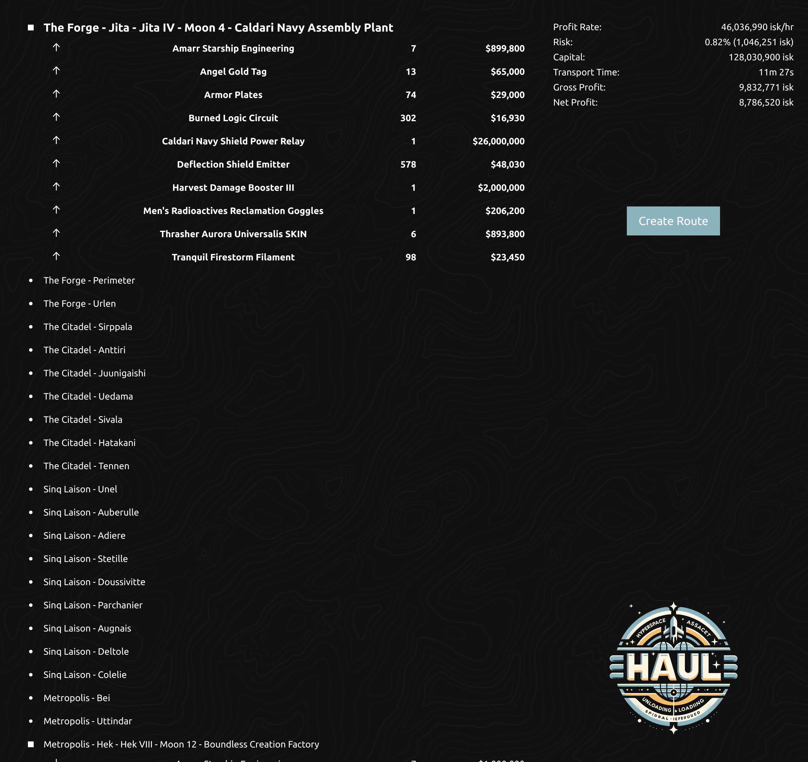

**HAUL**
========

*Hyperspace Asset Unloading and Loading*

**HAUL** is my old route planner and automation tool designed for EVE Online. It simplifies asset transportation by optimizing trade routes, automatically setting waypoints in-game, and identifying profitable trade opportunities through API integrations.



* * * * *

**Table of Contents**
---------------------

-   [Overview](#overview)
-   [Tech Stack](#tech-stack)
-   [Key Features](#key-features)
-   [Project Structure](#project-structure)

* * * * *

**Overview**
------------

HAUL is a full-stack application tailored for players of EVE Online, offering seamless route planning, waypoint automation, and trade optimization. It fetches live game data via the **EVE Swagger Interface (ESI)** API and utilizes modern web technologies to deliver a fast and interactive user experience.

The project comprises:

-   A **Python backend** that handles route calculations, API calls, and real-time updates.
-   A **React frontend** providing a clean and dynamic interface.
-   An **experimental Rust rewrite** of the backend focused on performance improvements.

* * * * *

**Tech Stack**
--------------

### **Backend (Python)**

-   **Framework**: FastAPI for high-performance API development.
-   **Asynchronous Processing**: `asyncio` for handling multiple concurrent API calls and tasks.
-   **API Integration**:
    -   Extensive use of the **EVE Swagger Interface (ESI)** API for fetching in-game data, such as trade orders, solar system details, and player locations.
-   **Automation**: Automatically sets waypoints in the EVE Online client through API interactions.
-   **Streaming Data**: Implements `StreamingResponse` to deliver real-time updates to the frontend.

### **Frontend (React)**

-   **Framework**: React for building dynamic, responsive user interfaces.
-   **State Updates**: Use of both polling and server-side events to update state

### **Experimental Rust Backend**
-   A rewrite of the Python backend focused on improving performance in API-intensive operations like route calculations

* * * * *

**Key Features**
----------------

1.  **Route Optimization**
    -   Calculates the shortest and safest routes between in-game locations based on:
        -   Travel time, warp speeds, and stargate connections.
        -   Risk factors, including security ratings of solar systems.
    -   Suggests optimized paths for asset transportation and trading.
    -   Automatically sets waypoints in the EVE Online client, simplifying navigation for players.

2.  **Profit Optimization**
    -   Identifies arbitrage opportunities by analyzing buy/sell orders across regions.
    -   Uses efficient filtering algorithms to recommend profitable trades.

3.  **Real-Time API Integration**
    -   Fetches live trade orders, player locations, and solar system details using the EVE Swagger Interface (ESI) API.
    -   Continuously updates routes and trade data in real-time.
    -   Utilizes server-sent events to deliver live updates on trade opportunities, routes, and player location changes.

* * * * *

**Project Structure**
---------------------

```
.
├── backend/             # Python backend
│   └── src/             # Core backend logic
├── frontend/            # React frontend
│   ├── src/             # React components
│   └── package.json     # Frontend dependencies
├── rust_backend/        # Experimental Rust rewrite
│   ├── src/             # Rust codebase
│   └── Cargo.toml       # Rust dependencies
```